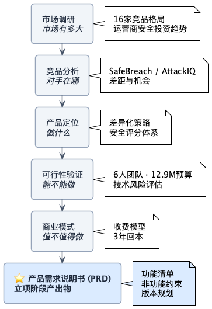
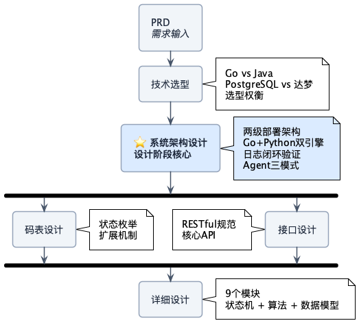

# AttackProbe

面向运营商/金融/能源行业的 **BAS（入侵与攻击模拟）平台** 设计方案。

---

## 为什么做这个

安全设备年年买，但有几个问题始终没人能答：

- 防火墙规则生效了吗？WAF 真的拦住攻击了吗？
- EDR 部署后，横向移动能检测到吗？
- 每年等保测评才发现问题，能不能主动验证？

**AttackProbe 的答案**：用真实攻击模拟验证防护体系，而不是等攻击者来告诉你。

---

## 核心设计

| 设计点 | 方案 | 为什么这么设计 |
|--------|------|----------------|
| **架构** | 集团+54省/专业公司两级 | 运营商组织架构决定，数据不出省 |
| **引擎** | Nuclei 60% + Python 30% + LLM 10% | Nuclei 快但覆盖不全，Python 补 ATT&CK 高级技术 |
| **验证** | 攻击→检测→告警→日志四环节闭环 | 光攻击不够，要验证整条防护链路 |
| **合规** | 达梦/OceanBase + 国密算法 | 央企信创硬性要求 |

---

## 阅读指引

### 立项调研 → 产出：[产品需求说明书](./00-立项/产品需求说明书.md)

从市场到需求的完整推导过程：

| 文档 | 解决什么问题 |
|------|-------------|
| [市场调研](./00-立项/运营商市场调研报告.md) | BAS 市场规模、运营商安全投资趋势、16家竞品格局 |
| [竞品分析](./00-立项/竞品深度分析报告.md) | SafeBreach/AttackIQ/Picus 怎么做的，差距在哪 |
| [产品定位](./00-立项/产品愿景与定位.md) | 差异化策略、目标客户画像、安全评分体系设计 |
| [可行性分析](./00-立项/可行性分析报告.md) | 6人团队能不能做、12.9M预算够不够、技术风险在哪 |
| [商业模式](./00-立项/商业模式与ROI分析.md) | 怎么收费、客户ROI、3年财务预测 |
| **[需求说明书](./00-立项/产品需求说明书.md)** | **⭐ 立项阶段产出物**，功能清单、非功能约束、版本规划 |

### 系统设计 → 核心：[系统架构设计](./01-设计/系统架构设计.md)

从需求到实现的技术方案：

| 文档 | 解决什么问题 |
|------|-------------|
| [技术栈评估](./01-设计/技术栈评估.md) | Go vs Java、PostgreSQL vs 达梦、选型依据与权衡 |
| **[系统架构](./01-设计/系统架构设计.md)** | **⭐ 设计阶段核心**，两级架构、节点协作、Agent设计、日志闭环 |
| [全局码表](./01-设计/全局码表设计.md) | 状态枚举统一管理，避免魔法数字 |
| [接口设计](./01-设计/接口设计.md) | RESTful 规范、核心 API 定义 |
| [详细设计](./01-设计/详细设计.md) | 9个模块的状态机、算法伪代码、数据模型 |

---

## 说明

- 所有市场数据来源于 Gartner、IDC、厂商官网、招投标公告
- 技术方案基于开源组件（Nuclei、Gin、Vue3），不涉及商业机密
- 本文档用于展示产品设计与系统架构能力

---

**作者**：江毅 | **时间**：2026年1月
